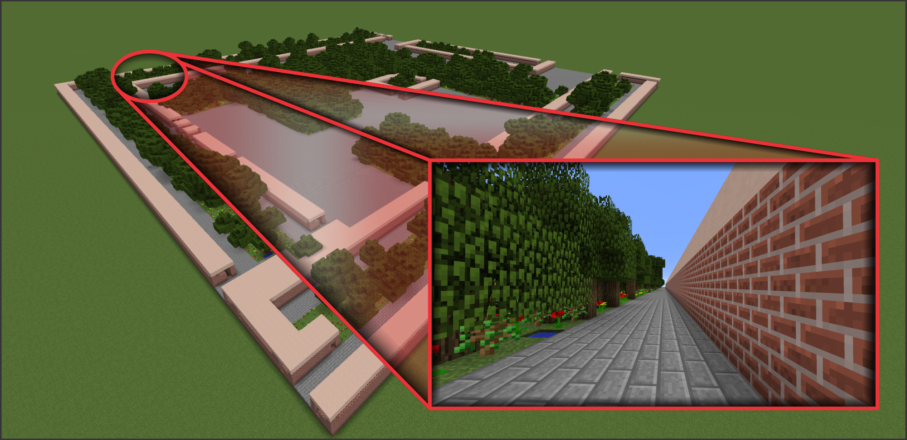
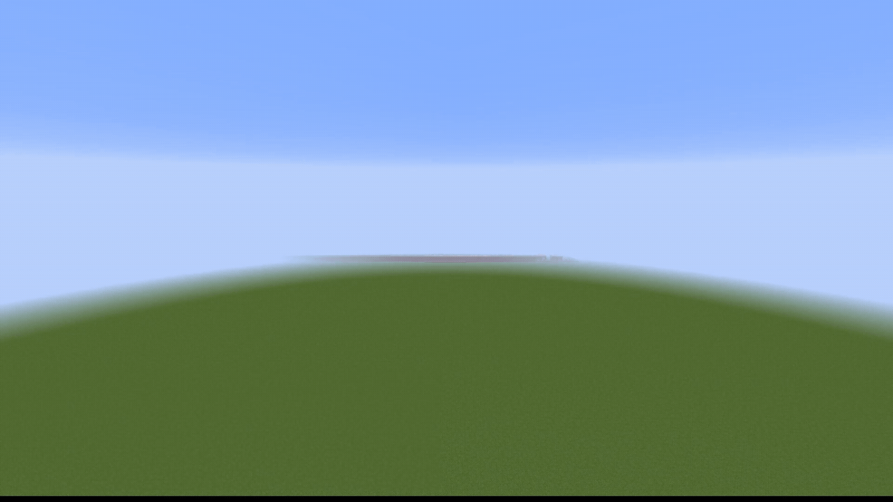
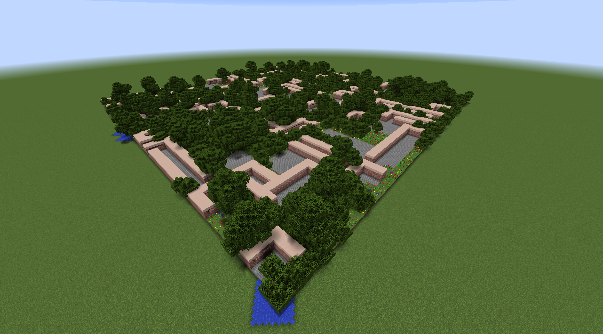
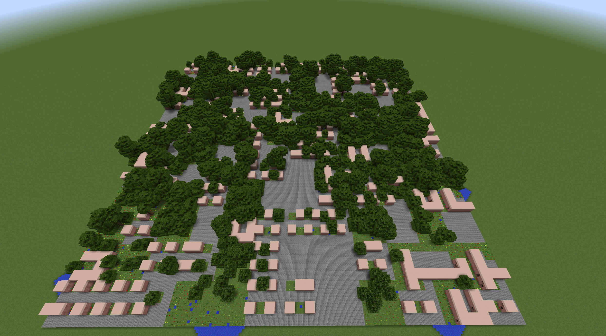
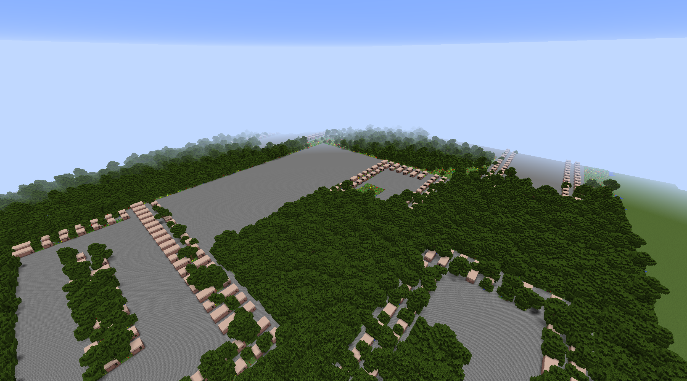
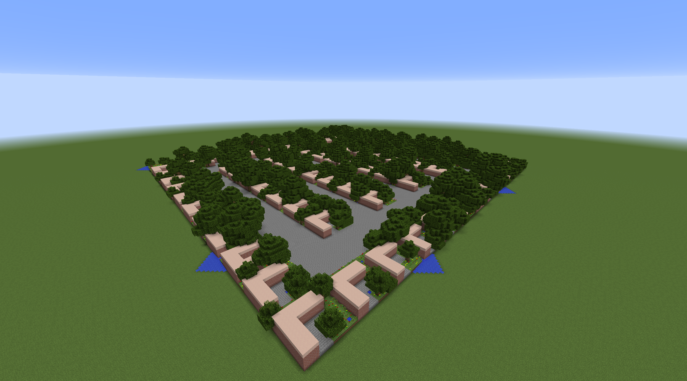
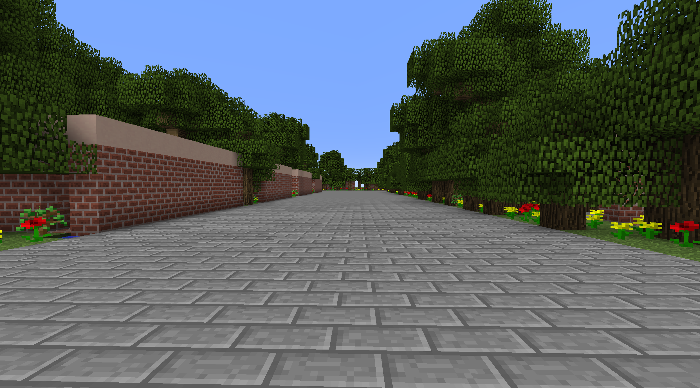
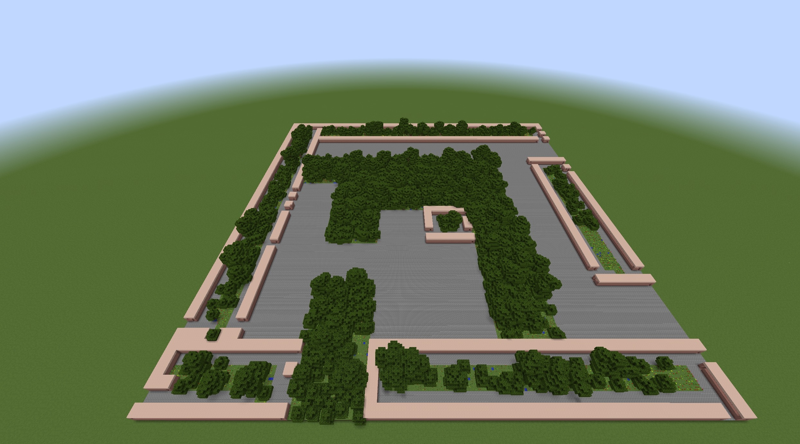
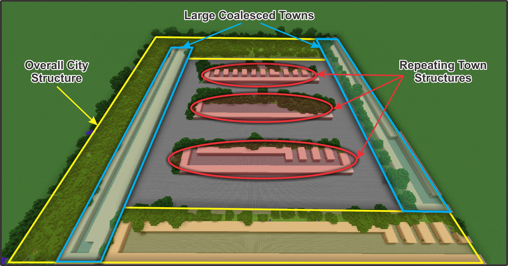

# MCHAMR - Multilevel Composition of Hierarchical and Adaptive Models via Recursion

<p align="center">
<a href="#how-this-works">Generation Approach</a> &mdash; <a href="#get-started">Get Started</a> &mdash; <a href="#demo">Demo</a> &mdash; <a href="#examples">Examples</a> 
</p>

- [MCHAMR - Multilevel Composition of Hierarchical and Adaptive Models via Recursion](#mchamr---multilevel-composition-of-hierarchical-and-adaptive-models-via-recursion)
  - [How this Works](#how-this-works)
  - [Environment Setup](#environment-setup)
  - [Experiments](#experiments)
    - [Demo](#demo)
    - [Get Started](#get-started)
    - [Visualise](#visualise)
    - [Create your own](#create-your-own)
    - [2D Visualisation](#2d-visualisation)
  - [Reproducibility](#reproducibility)
    - [Run Experiments](#run-experiments)
    - [Run Analysis and Generate Plots](#run-analysis-and-generate-plots)
  - [Code Structure](#code-structure)
  - [Examples](#examples)
- [Other repositories and projects used](#other-repositories-and-projects-used)
- [Issues](#issues)





## How this Works
This contains code for the method *MCHAMR*, which composes simple, low-level level generators together to generate large-scale structures. 

We specifically apply this method to [Minecraft](https://www.minecraft.net/) to generate towns and cities, and use the recent PCG method [PCGNN](https://github.com/Michael-Beukman/PCGNN) for these low-level generators.

For more information about our [Evocraft](https://evocraft.life/) submission, which used a very similar method, please see [here](https://github.com/Michael-Beukman/Evocraft22_PCGNN).
## Environment Setup
To set up your python environment, do the following to create an environment with the correct version.
```
conda create -n mchamr python=3.9
```

then run this to activate it
```
conda activate mchamr
```
And finally, install the necessary packages using pip.

```
pip install -r requirements.txt
```

**[Important]** Then, to run any python file in here, use `./run.sh path/to/python/file` from the root of this repository instead of using `python` directly, as otherwise modules are not recognised.

## Experiments
### Demo
To run a compositional demo that generates a city, you can run `./run.sh main/mchamr.py`. Be sure to follow the visualisation steps regarding the server and client [here](#visualise) first. You can alter the generated structure by changing the `main` function in this file as well.
### Get Started
If you want to start adapting the code and running your own experiments, the easiest would be to use the demo script (or any other script in `src/runs/proper_experiments/group/mcc/`) as a base, `src/runs/proper_experiments/group/mcc/demo/demo_mcc.py`.

For most of the other experiments in the `src/runs/proper_experiments/group/mcc/` folder, we have a different calling convention. Here, each individual run corresponds to a collection of letters; for example, to regenerate the house we used in most of our showcase images, you can run `./run.sh src/runs/proper_experiments/group/mcc/paper/3602_3d_house.py aab`.

After the experiments have run, their result files (including the actual evolved generators) will be stored in the `results/experiments` directory.
### Visualise
For minecraft, follow the [instructions](https://github.com/real-itu/Evocraft-py), and start the minecraft server & client first. The TL; DR is that you must `cd src/external/Evocraft-py` and run `java -jar spongevanilla-1.12.2-7.3.0.jar`. Then, open the Minecraft client and connect to localhost. Then you can run the visualisation code in a separate terminal.

```
./run.sh src/runs/proper_experiments/group/mcc/eval/viz.py 3001-a
```
to visualise the demo results.

To visualise the final composition, please run `./run.sh src/contrib/theory/mcc_paper.py`

### Create your own
To create your own experiment, follow these steps:
- Create a new level class for your structure in the directory `src/games/minecraft/new` (use e.g. `src/games/minecraft/twod/garden.py` as a starting point and just modifying the set of tiles available as well as the level size).
- Create a fitness function for your level, in the directory `src/contrib/fitness/minecraft/` (use e.g. `src/contrib/fitness/minecraft/twod/town/reachable.py` as a starting point). This fitness function class has a single method, `calc_fitness_single_level`, which takes in a level and returns a single floating point number between 0 and 1 representing the fitness.
- Create an experiment in the `src/runs/proper_experiments/group/mcc/` directory, copying e.g. `src/runs/proper_experiments/group/mcc/paper/3610_town.py`, changing the `NUM` and replacing everything in the large curly braces with (remembering to use your newly created classes): 

```python
  'aa': lambda LET: run_mcc(NUM, LET, level_class=<YOUR_LEVEL_CLASS>, additional_fitnesses=[<YOUR_Fitness_CLASS>], all_weights=None, distance_function=visual_diversity_normalised, max_dist=1, pop_size=30, generations=100, do_padding_randomly=False, number_of_random_variables=1, random_perturb_size=0, NUM_SEEDS=NUM_SEEDS, use_one_hot_encoding=False, USE_RAY=False)
```
- Then, you can run your experiment, `./run.sh path/to/file.py aa`, which will then run, and save its results to `results/experiments/`.


You can now follow the visualisation steps outlined above.

### 2D Visualisation
You can also use the following script to run a 2D visualisation:
```bash
./run.sh src/runs/proper_experiments/group/mcc/eval/viz2d.py <exp_name>
```

e.g.

```bash
./run.sh src/runs/proper_experiments/group/mcc/eval/viz2d.py 3551-hlb
```
## Reproducibility
This section covers the reproduction of our experiments. The result files are available in the `results` directory, so the first step can be skipped if desired.
### Run Experiments
Here, run all of the experiments in the `src/runs/proper_experiments/group/mcc/`. In particular, the following files map to the following experiments:
- `src/runs/proper_experiments/group/mcc/paper/v3551_larger.py` -> Different tile-sizes, from 1x1 to 10x10.
- `src/runs/proper_experiments/group/mcc/paper/v355{4,5,6,7,8,9}.py` and `src/runs/proper_experiments/group/mcc/paper/v3560.py`. These correspond to the experiment where we compare a flat and compositional approach for the task of copying a desired layout.
- The other experiments (`src/runs/proper_experiments/group/mcc/paper/3602_3d_house.py`, `src/runs/proper_experiments/group/mcc/evo/v3007_gardens.py`, `src/runs/proper_experiments/group/mcc/paper/3610_town.py`) are used for the showcase.
### Run Analysis and Generate Plots
To generate the plots, the files in `src/analysis` are needed. Specifically, run both `src/analysis/contrib/mchamr/analyse_flat_vs_compose.py` and `src/analysis/contrib/mchamr/analyse_different_tile_sizes.py`.
## Code Structure

The code is structured as follows
```
.
├── images
├── results                           -> Contains the trained generators
├── run.sh                            -> Script to use to run all code
└── src
    ├── analysis                      -> Code that analyses results and produces plots
    ├── baselines                     
    ├── common                        
    ├── contrib                       
    │   ├── fitness                   -> Where most of the fitness functions are
    │   ├── generation                -> The new, updated PCGNN generation
    │   ├── metrics
    │   ├── novelty
    │   └── theory                    -> Showcase results and the MCHAMR's implementation
    ├── experiments                   -> General experiment utilities
    ├── external                      -> External libraries/projects
    │   ├── Evocraft-py               -> Used to visualise the structures in Minecraft
    │   └── gym-pcgrl
    ├── games                         -> Here are the actual level definitions of each structure
    ├── metrics                       
    ├── novelty_neat                  -> The main PCGNN training method/loop
    ├── runs/proper_experiments       -> The actual experiments we ran
```

## Examples


<p align='center'>
  
   
  
</p>

<p align='center'>
  
   
  
</p>





# Other repositories and projects used
These can be found in `src/external`. We did edit and adapt some of the code, but most of it is still original.
- [gym_pcgrl](https://github.com/amidos2006/gym-pcgrl): Not used for this project,
- [PCGNN](https://github.com/Michael-Beukman/PCGNN): Provided the baseline code for this project.
- [Evocraft-py](https://github.com/real-itu/Evocraft-py) to actually place things in minecraft.

# Issues
If there are any issues, problems or suggestions, please file an issue.